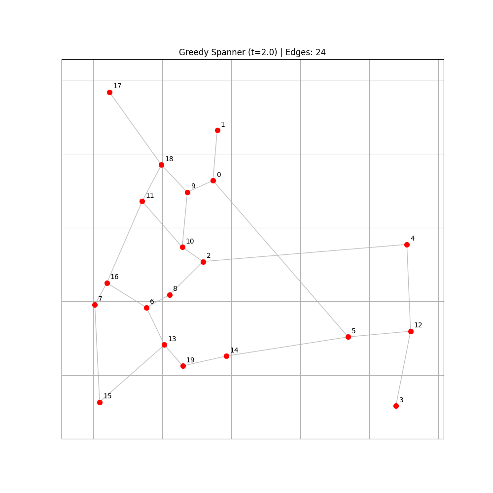

# 🕸️ Advanced Graph Algorithms: Greedy Spanner Implementation
**Efficient Network Construction using Geometric Constraints**

This repository contains a high-performance Python implementation of the **Greedy Spanner** algorithm. In computational geometry, a $t$-spanner is a subgraph where the shortest path between any two points is at most $t$ times their Euclidean distance.

## 🚀 Performance Metrics
- **Initial Complexity:** 190 potential edges (for 20 points).
- **Final Spanner:** Only **24 edges** retained.
- **Reduction Rate:** ~87.4% edge reduction while maintaining connectivity and stretch factor constraints.

## 📊 Visual Result

*Red dots represent nodes, and gray lines represent the computed $t$-spanner edges ($t=2.0$).*

## 🛠️ Built With
- **NetworkX:** For graph topology management.
- **SciPy:** For spatial distance computations.
- **Matplotlib:** For high-quality geometric visualization.

---
*This project serves as a baseline for my ongoing research on ML-based pruning for geometric algorithms.*
